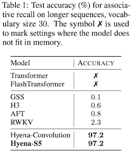
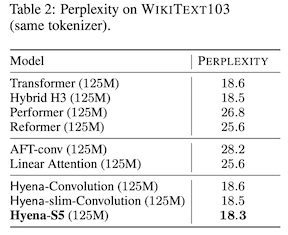

# Experimental: Language Modeling

This branch provides preliminary examples using [S5](https://arxiv.org/abs/2208.04933) for language modeling. We have 
reused the pytorch dataloading code and ported some of the source code from the [Safari](https://github.com/HazyResearch/safari) Convolutions for 
Sequence Modeling repository, including the core code required for the Associative Recall in-context learning task 
and Wikitext-103 as performed in the [H3](https://arxiv.org/abs/2212.14052) and 
[Hyena](https://arxiv.org/abs/2302.10866) papers. The training loop implementation of this branch was inspired by the [TECO](https://github.com/wilson1yan/teco) repository.  

We hope to continue to add experiments on larger datasets and plan to merge the infrastructure developed in this branch (pmapping, checkpointing, more general experiment loading)
into the main branch.


## State Spaces for Language Modeling
[H3](https://arxiv.org/abs/2212.14052) proposed combining data-controlled multiplicative gating with SSMs (in particular [S4D](https://arxiv.org/abs/2206.11893)) and 
showed strong performance (when combined with a couple of attention layers in a hybrid model) on [OpenWebText](https://huggingface.co/datasets/openwebtext) , [WikiText-103](https://huggingface.co/datasets/wikitext) and the [Pile](https://pile.eleuther.ai/).
[Hyena](https://arxiv.org/abs/2302.10866) generalized the notion of multiplicative gating and also replaced the SSMs of H3 with implicit convolutions, since using S4D for the convolution seemed to not perform as well on 
synthetic in-context learning tasks developed in the H3 paper (e.g. associative recall with 131K length sequences). Hyena showed strong attention-free performance and the ability to match perplexity and downstream performance of Transformers when trained on The Pile.  
A disadvantage of Hyena's implicit convolutions is that it loses the recurrent formulations that SSM methods such as S4D/S5 provide, which allow for fast autoregressive generation.

Are the implicit convolutions necessary and are SSM methods really not expressive enough? We were curious to just plug S5 SSMs in for the Hyena implicit convolution filters. We will refer to this as Hyena-S5
since we used the exact Hyena operator implementation (ported into JAX) and simply replaced the implicit convolutions. However,
we also note that when only order 2 operators are used (as we do here), this is essentially H3, but with S5 used instead of S4D (and a short convolution instead of H3's shift matrix).

Our results indicate that Hyena-S5 can solve the challenging associative recall in-context learning tasks and can also outperform Transformers on WikiText without any attention layers. We fully recognize that these are relatively small scale results these days, but it is at least a datapoint that S5 combined with 
multiplicative gating can potentially be very effective.  We hope to scale up these and other ideas to larger datasets soon, stay tuned! 


## Language Modeling Synthetics
Use these commands to run Hyena and Hyena-S5 on the 131K sequence length, vocab size 30 and 40 associative recall tasks 
(be sure to fill out the data_dir and wandb info in the corresponding config file):

### Small cpu test
You can run a small test (seq_len=20, vocab=10) that should run on a cpu by running this command:
```commandline
python train.py -o output_dir_name -c configs/hyena_S5/associative_recall_20K_10_S5.yaml
```

### Associative Recall, 131K, vocab=30

Hyena
```commandline
python train.py -o output_dir_name -c configs/hyena/associative_recall_131K_30_hyena.yaml
```

Hyena-S5
```commandline
python train.py -o output_dir_name -c configs/hyena_S5/associative_recall_131K_30_S5.yaml
```

We averaged Hyena-S5 over 10 random seeds and obtained an average accuracy of 97.2%, which matches the performance reported for 
Hyena with implicit convolutions. For comparison we have added our result to the table from [Hyena](https://arxiv.org/abs/2302.10866):



See an example wandb run for both Hyena and Hyena-S5 here: [here](https://api.wandb.ai/links/jimmysmith1919/15am8usz). 


### Associative Recall, 131K, vocab=40
We also include runs for the vocab 40 setting. 

Hyena
```commandline
python train.py -o output_dir_name -c configs/hyena/associative_recall_131K_40_hyena.yaml
```

Hyena-S5
```commandline
python train.py -o output_dir_name -c configs/hyena_S5/associative_recall_131K_40_S5.yaml
```
See an example wandb run for both Hyena and Hyena-S5 here: [here](https://api.wandb.ai/links/jimmysmith1919/jful23a1). 


## WikiText-103
Run these commands to run Hyena and Hyena-S5 on Wikitext-103:

Hyena
```commandline
python train.py -o output_dir_name -c configs/hyena/wikitext_hyena.yaml
```

Hyena-S5
```commandline
python train.py -o output_dir_name -c configs/hyena_S5/wikitext_S5.yaml
```

See an example wandb run for both Hyena and Hyena-S5 here: [here](https://api.wandb.ai/links/jimmysmith1919/ddfhke4q). 
Hyena-S5 achieves 18.3 perplexity after 100K steps. For comparison, we have added our result to the table from [Hyena](https://arxiv.org/abs/2302.10866):




Please reach out if you have any questions or feedback.

-- The S5 authors.

