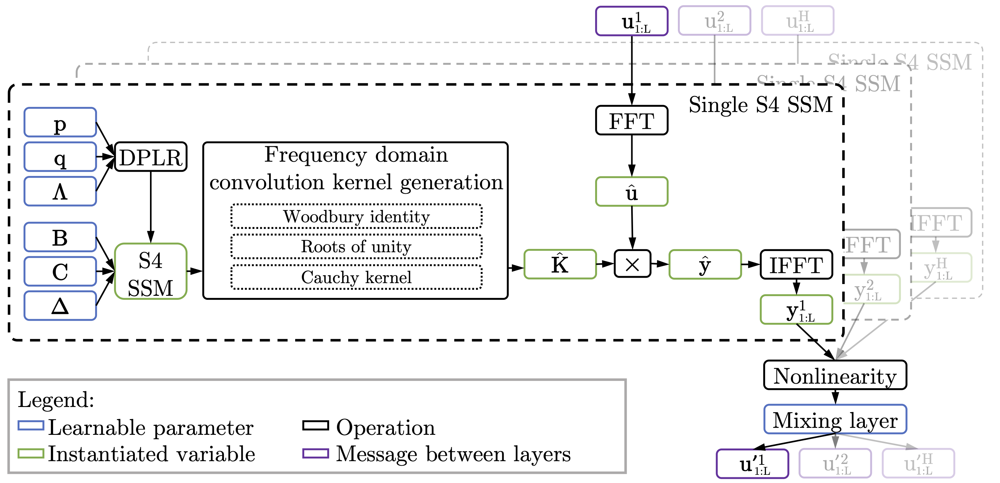
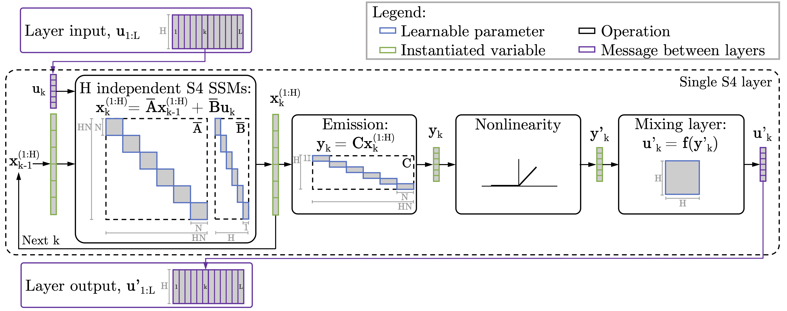

# S5: Simplified State Space Layers for Sequence Modeling

_By [Jimmy Smith](https://icme.stanford.edu/people/jimmy-smith), [Andrew Warrington](https://github.com/andrewwarrington) & [Scott Linderman](https://web.stanford.edu/~swl1/)._

_This post accompanies the preprint Smith et al [2022], available [here](https://arxiv.org/pdf/2208.04933.pdf).  Code for the paper is available [here](https://github.com/lindermanlab/S5)_.

## TL;DR.
In our preprint we demonstrate that we can build a state-of-the-art deep sequence-to-sequence model using by stacking many dense, multi-input, multi-output (MIMO) state space models (SSMs) as a layer.  This replaces the many single-input, single-output (SISO) SSMs used by the _structured state space sequence_ (S4) model [Gu et al, 2021].  This allows us to make use of efficient parallel scan to achieve the same computational effiency of S4, without the need to use frequency domain and convolutional methods.  We show that S5 achieves the same, if not better, performance than S4 on a range of long-range sequence modeling tasks.

_Figure 1: Our S5 layer uses a single, dense, multi-input, multi-output state space model as a layer in a deep sequence-to-sequence model._

## S4 is Epically Good.  So... Why?

_Figure 2: A schematic of the computations required by S4.  \\(H\\) SISO SSMs are applied in the frequency domain, passed through a non-linearity, and then mixed to provide the input to the next layer.  Deriving the "Frequency domain convolution kernel generation" (and the required parameterization, indicated in blue) is the primary focus of Gu et al [2021]._

The performance of S4 is unarguable.  Transformer-based methods were clawing for single percentage point gains on the long range arena benchmark dataset [Tay et al, 2021].  S4 beat many SotA transformer methods by as much as twenty percentage points.  AND, to top it off, could process sequences with complexity linear in the sequence length, and sublinear in parallel time (with a reasonable number of processors).  

However, the original S4 is a very involved method.  It required specific matrix parameterizations, decompositions, mathematical identities, Fourier transforms, and more, as illustrated in [Figure 2](#fig_s4_stack).  As a research group, we spent several weeks trying to understand all the intricacies of the method.  This left us asking:  is there a different way of using the same core concepts, retaining performance and complexity, but, maybe, making it (subjectively, we admit!) simpler?  

Enter S5.  

## From SISO to MIMO.  From Convolution to Parallel Recurrence.

_Figure 3: Our S5 layer uses a single, dense, multi-input, multi-output state space model as a layer in a deep sequence-to-sequence model._

---

todo

---

## S4 and Its Variants.
Since publishing the original S4 model, the original authors have released three further papers studying the S4 model.  Most significant of those papers are S4D [Gu, 2022] and DSS [Gupta, 2022].  These paper explores using diagonal state spaces, similar to what we use.  S4D provided a proof as to why the (diagonalizable) normal matrix, from the normal-plus-low-rank factorization of the HiPPO-LegS matrix, provides such a good initialization for SISO systems.  We show (although its really not that difficult!) that using this initialization in the MIMO case enjoys similar characteristics.  We note, however, that S4D and DSS provide computationally simpler implementations of S4; but, doe not perform quite as strongly.  Most importantly, though, S5 isn't the only simplification to S4.  

## Other Resources.
- Much of our understanding and early code was based on the _excellent_ blog post, _The Annotated S4_, by [Rush and Karamcheti \[2021\]](https://srush.github.io/annotated-s4/).
- Full code for the original S4 implementation, and many of its forerunners and derivatives, is available [here](https://github.com/HazyResearch/state-spaces).  
- Instructions for obtaining the LRA dataset are [here](https://openreview.net/pdf?id=qVyeW-grC2k).

## Awesome Other Work.
There are obviously many other great researchers working on adapting, extending, and understanding S4.  We outline some very recent work here:

- Mega, by Ma et al [2022], combines linear state space layers with transformer heads for sequence modeling.  The main Mega method has \\(O(L^2)\\) complexity.  A second method, Mega-chunk, is presented that has \\(O(L)\\), but does not achieve the same performance as Mega.  Combining SSMs with transformer heads is a great avenue for future work.
- Liquid-S4, by Hasani et al [2022], extends S4 by adding a dependence on the input signal into the state matrix.  When expanded, this is equivilant to adding cross-terms between the \\(k^{th}\\) input and all previous inputs.  Evaluating all previous terms is intractable, and so this sequence is often truncated.  Extending the linear SSM, such that it is conditionally linear, is a really exciting opportunity for making the more model of linear state space layers more expressive. 
- ADD "what makes conv great" once it is de-anonymysed. 

 
## Bibliography
- Smith, Jimmy TH, Andrew Warrington, and Scott W. Linderman. "Simplified State Space Layers for Sequence Modeling." arXiv preprint arXiv:2208.04933 (2022).  [Link](https://arxiv.org/pdf/2208.04933.pdf).
- Gu, Albert, Karan Goel, and Christopher Re. "Efficiently Modeling Long Sequences with Structured State Spaces." International Conference on Learning Representations (2021).  [Link](https://openreview.net/pdf?id=uYLFoz1vlAC).
- Rush, Sasha, and Sidd Karamcheti. "The Annotated S4." Blog Track at ICLR 2022 (2022).  [Link](https://srush.github.io/annotated-s4/).
- Yi Tay, et al. "Long Range Arena : A Benchmark for Efficient Transformers ." International Conference on Learning Representations (2021).  [Link](https://openreview.net/pdf?id=qVyeW-grC2k).
-  Ma, Xuezhe, et al. "Mega: Moving Average Equipped Gated Attention." arXiv preprint arXiv:2209.10655 (2022).  [Link](https://arxiv.org/pdf/2209.10655).  
- Hasani, Ramin, et al. "Liquid Structural State-Space Models." arXiv preprint arXiv:2209.12951 (2022).  [Link](https://web10.arxiv.org/pdf/2209.12951.pdf). 
- Gu S4d.

